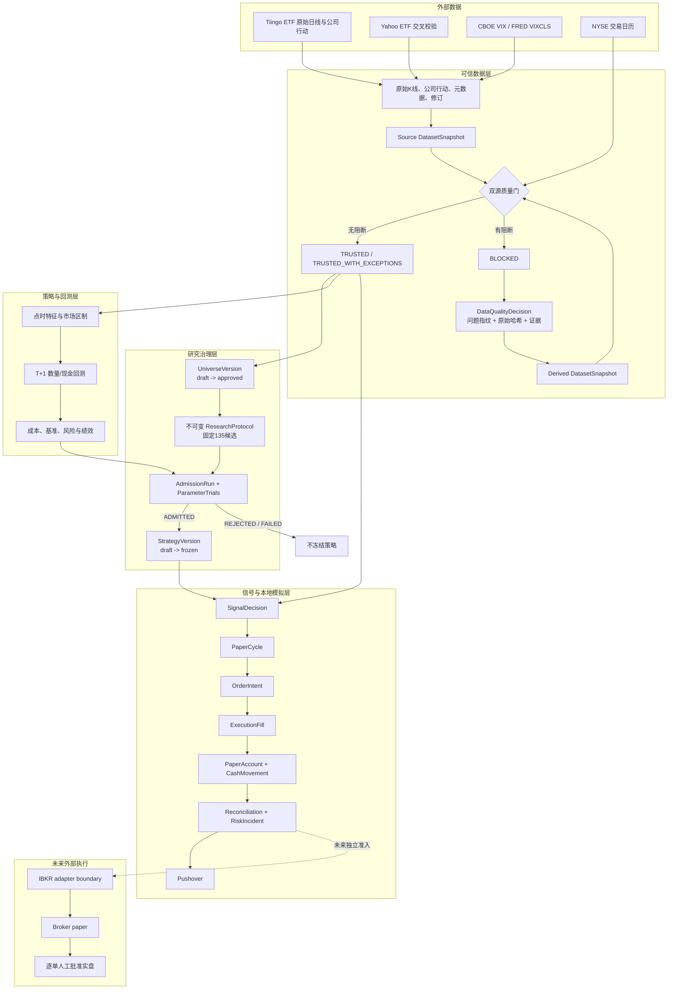
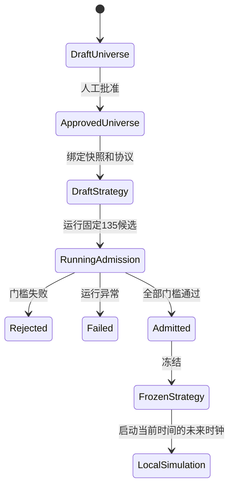
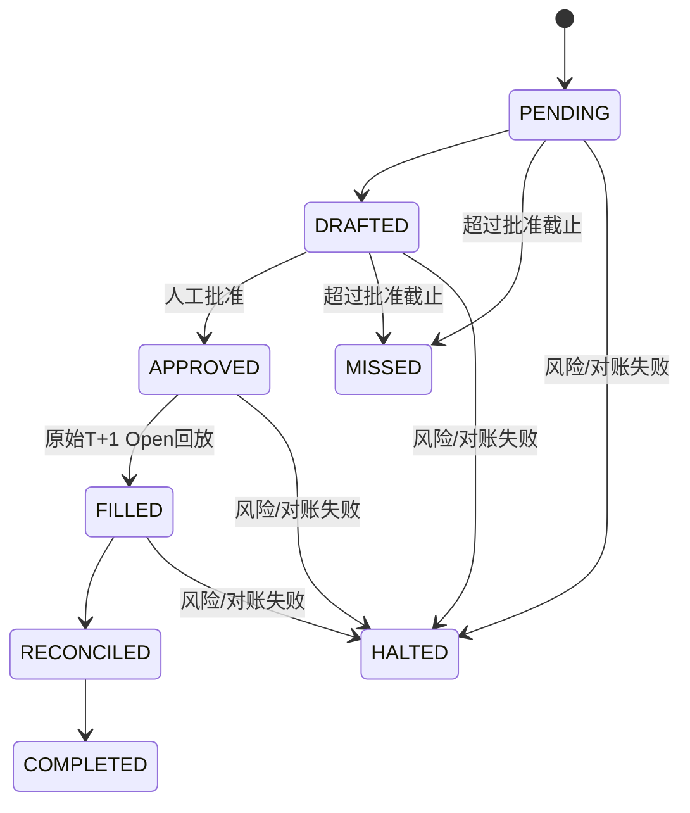

# Quant System v3 架构说明

语言：中文 | [English](quant_system_architecture_overview_en.md)

更新日期：2026-08-26

## 1. 架构目标

Quant System v3 是一个单人、长仓、现金账户 ETF 轮动研究系统。架构首先保证
可追溯性和失败关闭，其次才是计算绩效。

核心不变量：

1. 研究结果必须绑定代码提交、不可变数据快照、ETF 宇宙和研究协议。
2. `BLOCKED` 数据不能进入正式回测、准入、策略冻结或订单。
3. T 日收盘后计算的信号只能在 T+1 或更晚执行。
4. 回测和本地模拟使用持股数量、现金和结算账本，不隐含免费再平衡。
5. 只有完整 `ADMITTED` 运行才能冻结策略；Dashboard 实验不能替代准入。
6. 本地 `REPLAY_OPEN`、broker paper 和实盘是三个不同证据等级。
7. 外部 broker 连接和真实下单默认关闭，并由两个独立开关保护。

## 2. 系统上下文



正式 Dashboard、因子监控、Monte Carlo 和 Robinhood 镜像是研究/诊断入口，
不会绕过上述治理链调用 broker 或真实下单。

## 3. 分层与模块职责

| 层 | 主要模块 | 职责 |
|---|---|---|
| 配置 | `config/settings.py`, `config/universe.py` | 策略、风险、执行模式、初始 ETF 池和资格规则 |
| 数据 | `data/providers.py`, `data/trusted_loader.py`, `data/quality.py` | 抓取、复权、双源检查、快照和窄范围裁决 |
| 策略 | `strategy/momentum_rotation.py`, `strategy/regime.py` | 动量排名、正动量门槛和市场区制 |
| 风险 | `risk/engine.py`, `risk/covariance.py`, `risk/controls.py` | 波动率缩放、权重约束、停机和敞口检查 |
| 回测 | `backtest/engine.py`, `backtest/ledger.py` | T+1 事件顺序、数量/现金账本、结算和成本 |
| 研究 | `research/protocol.py`, `research/nested_walk_forward.py` | 135候选协议、嵌套扩展窗口和准入门槛 |
| 服务 | `services/signal_service.py`, `services/paper_cycle.py` | 版本化信号、本地模拟、恢复和通知 |
| 执行 | `execution/pretrade.py`, `execution/oms.py`, `execution/adapters.py` | 预交易检查、OMS 状态机和 broker 隔离边界 |
| 存储 | `storage/schema.py`, `storage/repositories/` | SQLite/SQLAlchemy 表、外键、幂等和生命周期校验 |
| 入口 | `scripts/`, 正式 Streamlit Dashboard | 可审计 CLI、研究界面和运维入口 |

## 4. 可信数据架构

### 4.1 数据来源

- ETF 主源：Tiingo 原始 OHLCV、分红和拆股。
- ETF 校验源：Yahoo；主源失败时不得静默升级为主源。
- VIX：CBOE 历史数据为主，FRED `VIXCLS` 为官方再发布校验路径。
- 组合交易日历：NYSE；VIX 独有日期不能进入 ETF 收益或执行日历。

Tiingo Token 只从进程内存/环境读取，并通过请求头发送。供应商请求限制在批量执行前
预检；HTTP 429 被记录为 `provider_rate_limit`，不触发无声降级。

### 4.2 原始、来源和派生快照

`TrustedMarketDataLoader` 保存：

- `raw_market_data`：供应商原始 K 线；
- `corporate_actions`：分红和拆股；
- `security_master`：证券元数据；
- `data_revisions`：供应商修订；
- `dataset_snapshot_bars/actions`：某次研究实际使用的不可变副本；
- `dataset_snapshots`：内容哈希、原始数据哈希、质量报告和来源。

本地总回报价格由 `data/adjustments.py` 统一生成，不增量拼接供应商的历史复权价。

### 4.3 质量门

可执行快照必须满足：

- 最近完整 NYSE 会话陈旧度为 0；陈旧 1 个会话仅诊断，2 个以上阻断；
- 分拆口径标准化后，跨源收盘差异大于 5 bp 告警、大于 20 bp 阻断；
- 分红/拆股缺失或金额冲突阻断；
- ETF 单日绝对收益超过 10% 必须由第二来源或公司行动确认；
- 原始/内容/裁决哈希和质量状态必须互相一致。

`TrustedMarketDataLoader.load(require_actionable=True)` 默认失败关闭。只有质量诊断
调用者可以显式使用 `require_actionable=False`。

### 4.4 数据裁决

`DataQualityDecision` 是不可变记录，至少绑定：

- source snapshot ID 和原始数据 SHA-256；
- 精确 issue fingerprint、问题代码、ticker 和日期范围；
- 标准化规则、官方证据 URI、理由、操作人和时间。

裁决不修改来源快照。系统创建新的派生快照，并把 `decision_set_hash` 写入内容身份。
供应商值或原始哈希变化后，旧裁决自动失效。整个 ticker、全部历史或降低全局 20 bp
门槛的豁免不受支持。

## 5. ETF 宇宙、策略与回测

### 5.1 ETF 宇宙

初始候选池为 25 只：24 只风险 ETF 和现金 ETF `BIL`。风险 ETF 分布于美国股票、
海外股票、债券、实物/另类资产和行业板块。

风险 ETF 在历史时点需要：

- 至少 756 个交易会话；
- 60 日中位成交额不少于 2,500 万美元；
- 价格不少于 5 美元；
- 数据完整率不少于 98%；
- 已确认不是杠杆或反向产品。

`UniverseVersion` 只能先创建为 `draft`，再由独立命令人工批准。季度变化只影响未来，
不得回填历史。当前 `historical_universe_integrity=false`，所以历史结果只能称为
`CURRENT_UNIVERSE_BACKCAST`。

### 5.2 核心策略

正式策略是月频长仓轮动：

- 20/60/120 日动量与低波动因子用于排名；
- 加权原始动量必须大于 0；
- 选择前 3/4/5 只风险 ETF；
- 目标波动率为 8%/10%/12%；
- 单只风险资产目标权重为 10%-35%；
- 低于 10% 的风险权重退出，残余进入 `BIL`；BIL 异常时进入 `CASH_USD`，
  不重新放大其他风险仓位；
- sample covariance 是默认风险模型。

日频和周频可以用于探索，但必须标记 `exploratory_only`，不能进入正式准入排名。

### 5.3 回测事件顺序

```text
T 收盘后：计算特征、区制和目标权重
T+1 开盘：按原始 Open 加成本成交
T+1 收盘：按持股数量估值，权重自然漂移
成交后下一 NYSE 会话：完成美股 T+1 结算并更新三类现金
```

缺少 T+1 Open、活跃持仓价格或验证窗口 BIL 收益时直接阻断，不回退到 Close 或
填 0。账本保留碎股数量、美元现金、待结算款、交易成本和订单级审计。

研究成本使用 2/7/20 bp 三种情景。订单达到 0.1% ADV 后启用平方根冲击；超过
1% ADV 阻断。风险关闭成交至少采用 20 bp 的成本情景。

### 5.4 风险控制

- 15% 高水位回撤：T+1 清仓草案；最早下一月度调仓日、完成对账和人工授权后恢复；
- 5% 单日损失：停机但不自动清仓；最早下一 NYSE 会话人工恢复；
- 风险仓位漂移超过 35% 告警，超过 40% 进入人工复核；
- 负现金、融资、空头、未知持仓、账户差异、陈旧数据和超 ADV 订单均失败关闭。

15% 是触发值，不是损失保证；跳空和滑点可能造成更大实际回撤。

## 6. 研究治理与准入

`ResearchProtocol` 锁定代码提交、快照、宇宙、参数网格、成本、折叠日期、基准和
选择规则。核心网格固定为：

```text
5组因子权重 x 3个top_n x 3个目标波动率 x 3个区制 = 135个候选
```

嵌套扩展窗口要求至少五年训练历史，外层测试窗为 12 个月。每一折重新计算特征、
参数、组合和风险模型；最终候选结果、失败和中断状态均持久化到
`AdmissionRun`/`ParameterTrial`。

治理生命周期：



冻结策略前，数据库必须存在：

- 可执行不可变快照；
- 已批准宇宙；
- 完整、终态的 `AdmissionRun`；
- 恰好 135 个唯一最终候选结果；
- 明确为真的所有准入门槛。

调用者不能自行传入可信的 `admissible=True`，也不能回填本地模拟起点。

## 7. 信号、OMS 与本地模拟

### 7.1 SignalDecision

`SignalService` 输出：策略/宇宙/快照版本、信号日期、数据日期、生成时间、下一执行
会话、目标和当前权重、美元差额、预计成本、数据问题和风险状态。

状态为：

- `DIAGNOSTIC`：非正式时点或仅供查看；
- `ACTIONABLE`：月末 T 日 20:30 ET 至 T+1 09:25 ET，且全部治理门通过；
- `BLOCKED`：数据或治理证据不完整；
- `HALTED`：账户风险状态禁止执行。

超过 T+1 09:25 ET 未获批准的周期记为 `MISSED`，不能事后伪造订单。

### 7.2 本地 REPLAY_OPEN

`PaperCycle` 以 SQLite 为唯一事实源：



`OrderIntent` 使用稳定客户端 ID，`ExecutionFill` 使用幂等 broker execution ID；
`PARTIAL`/`FILLED` 只由累计持久化成交数量决定。卖单优先，买单不得超过可用现金，
禁止融资、杠杆和空头。

本地成交价是 T+1 原始 Open 加预注册成本，不是交易所撮合。09:35 到达报价、限价单、
五分钟撤单、真实部分成交和碎股路由必须留给未来 broker paper 验证。

### 7.3 对账、事故与告警

对账覆盖：持仓数量、settled/unsettled/available cash、NAV 恒等式、成交、佣金、
未知持仓和未完成订单。

系统先提交 `RiskIncident`，再调用 Pushover。发送失败保留为待重试状态；重试不会
复制事故。收到通知不等于事故已经对账或恢复。

## 8. 存储模型

| 领域 | 关键实体 | 身份/约束 |
|---|---|---|
| 数据 | `DatasetSnapshot`, `DataQualityDecision` | 内容、原始数据和裁决集合哈希 |
| 宇宙 | `UniverseVersion` | 版本不可变，draft 与人工批准分离 |
| 研究 | `StrategyVersion`, `AdmissionRun`, `ParameterTrial` | 外键、终态和135候选完整性 |
| 信号 | `SignalDecision`, `PaperCycle` | 环境+策略+信号会话唯一 |
| 执行 | `OrderIntent`, `ExecutionFill` | 客户端订单和成交 ID 幂等 |
| 账户 | `PaperAccount`, `PaperCashMovement` | 乐观版本、T+1 结算键 |
| 控制 | `Reconciliation`, `RiskIncident` | 关联账户、周期、订单与恢复授权 |

Alembic 当前 head 为 `5f74c1a9d2b0`。旧 `market_data` 和实验表保留用于审计，
但没有可信快照引用的旧实验被标记为 `invalid_data_v1`。SQLite 是当前唯一完成全套
迁移和恢复验证的数据库后端。

## 9. 入口与部署边界

| 入口 | 角色 |
|---|---|
| `Open Quant Dashboard.cmd` | 正式 Streamlit 研究入口 |
| `streamlit_dashboard_db_v1_1_save_experiment.py` | 正式 Dashboard 实现 |
| `scripts.build_trusted_snapshot` | 构建双源快照 |
| `scripts.record_data_quality_decision` | 保存窄范围裁决 |
| `scripts.run_core_admission` | 唯一核心准入入口 |
| `scripts.paper_cycle` | 幂等本地模拟 CLI |
| `Open Robinhood Mirror.cmd` | 独立只读持仓镜像 |

`main.py`、`main_with_db.py`、`streamlit_dashboard_db.py` 和 `DNU/` 是遗留兼容路径，
不能作为准入或订单入口。

运行模式：

| 模式 | Broker连接 | 真实提交 | 当前可用性 |
|---|---:|---:|---|
| `PERSONAL_RESEARCH` | 否 | 否 | 默认模式 |
| `BROKER_PAPER` | 是 | 否 | 尚未接入/验证 |
| `MANUAL_LIVE` | 是 | 是 | 尚未准入；必须逐单人工批准 |

## 10. 当前运行状态

截至 2026-08-26：

- 5 个 `DatasetSnapshot` 全部为 `BLOCKED`；最新快照仍有 706 个未裁决问题；
- `UV-001` 为 `draft`，`historical_universe_integrity=false`；
- `StrategyVersion`、`AdmissionRun` 和 `ParameterTrial` 均为 0；
- 信号、模拟周期、账户、订单、成交、对账和事故记录均为 0；
- 工程测试 270 项通过，SQLite 完整性与外键检查正常。

所以当前系统状态是“基础设施已实现，研究结论尚未产生”。数据问题解决并通过正式
准入之前，不得启动本地未来时钟或推断实盘日期。

项目定位与路线见 [项目简介](PROJECT_OVERVIEW.md)，操作步骤见
[运行手册](docs/upgrade_v3_runbook.md)。
