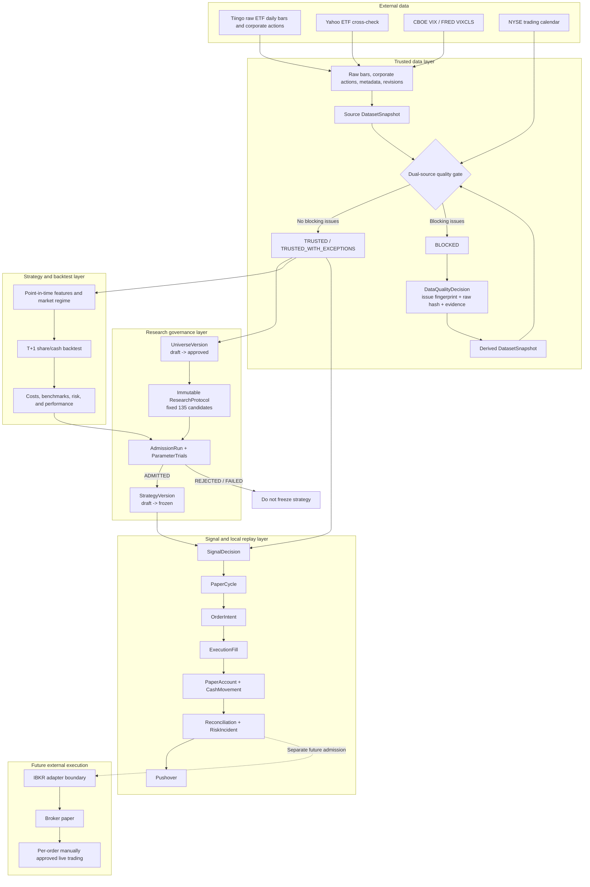
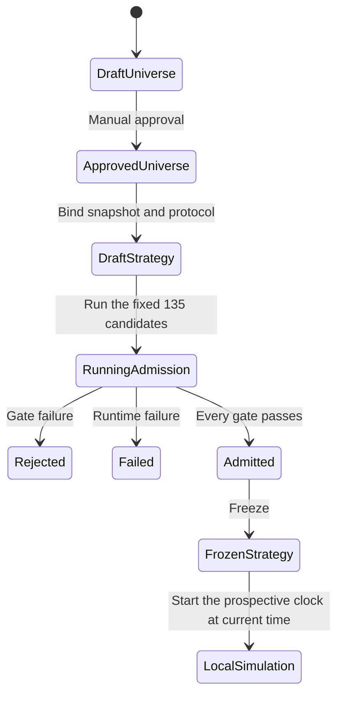
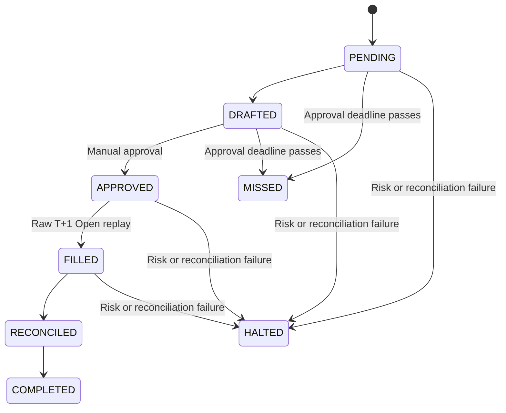

# Quant System v3 Architecture

Language: [中文](quant_system_architecture_overview.md) | English

Last updated: 2026-08-26

## 1. Architecture Goals

Quant System v3 is a single-user, long-only ETF rotation research system for a
cash account. Its architecture prioritizes traceability and fail-closed
behavior before performance computation.

Core invariants:

1. Every research result must bind a code commit, immutable data snapshot, ETF
   universe, and research protocol.
2. `BLOCKED` data cannot enter formal backtests, admission, strategy freeze, or
   orders.
3. A signal calculated after the close on T can execute only on T+1 or later.
4. Backtests and local replay use shares, cash, and settlement ledgers without
   implicit free rebalancing.
5. Only a complete `ADMITTED` run can freeze a strategy; Dashboard experiments
   cannot substitute for admission.
6. Local `REPLAY_OPEN`, broker paper, and live trading are three distinct
   evidence levels.
7. External broker connectivity and real order submission are disabled by
   default and protected by two independent switches.

## 2. System Context



The formal Dashboard, factor monitoring, Monte Carlo analysis, and Robinhood
mirror are research or diagnostic entry points. They cannot bypass this
governance chain to call a broker or submit real orders.

## 3. Layers and Module Responsibilities

| Layer | Primary modules | Responsibility |
|---|---|---|
| Configuration | `config/settings.py`, `config/universe.py` | Strategy, risk, execution mode, initial ETF pool, and eligibility rules |
| Data | `data/providers.py`, `data/trusted_loader.py`, `data/quality.py` | Acquisition, adjustments, dual-source checks, snapshots, and narrow adjudication |
| Strategy | `strategy/momentum_rotation.py`, `strategy/regime.py` | Momentum ranking, positive-momentum gate, and market regime |
| Risk | `risk/engine.py`, `risk/covariance.py`, `risk/controls.py` | Volatility scaling, weight constraints, halts, and exposure checks |
| Backtest | `backtest/engine.py`, `backtest/ledger.py` | T+1 event ordering, share/cash ledger, settlement, and costs |
| Research | `research/protocol.py`, `research/nested_walk_forward.py` | 135-candidate protocol, nested expanding windows, and admission gates |
| Services | `services/signal_service.py`, `services/paper_cycle.py` | Versioned signals, local replay, recovery, and notifications |
| Execution | `execution/pretrade.py`, `execution/oms.py`, `execution/adapters.py` | Pre-trade checks, OMS state machine, and broker isolation boundary |
| Storage | `storage/schema.py`, `storage/repositories/` | SQLite/SQLAlchemy tables, foreign keys, idempotency, and lifecycle validation |
| Entry points | `scripts/`, formal Streamlit Dashboard | Auditable CLI, research interface, and operations surface |

## 4. Trusted Data Architecture

### 4.1 Data Sources

- ETF primary source: Tiingo raw OHLCV, dividends, and splits.
- ETF validation source: Yahoo. A primary-source failure never silently promotes
  Yahoo to the primary source.
- VIX: CBOE historical data as the primary path and FRED `VIXCLS` as the
  official republication cross-check.
- Portfolio trading calendar: NYSE. VIX-only dates cannot enter ETF returns or
  execution calendars.

The Tiingo token is read only from process memory or the environment and sent
in request headers. Provider request quotas are checked before batch execution.
HTTP 429 is recorded as `provider_rate_limit` and does not trigger silent
degradation.

### 4.2 Raw, Source, and Derived Snapshots

`TrustedMarketDataLoader` stores:

- `raw_market_data`: raw provider bars;
- `corporate_actions`: dividends and splits;
- `security_master`: security metadata;
- `data_revisions`: provider revisions;
- `dataset_snapshot_bars/actions`: immutable copies actually used by a research
  run;
- `dataset_snapshots`: content hash, raw-data hash, quality report, and lineage.

`data/adjustments.py` produces local total-return prices with one deterministic
algorithm. The system does not incrementally splice provider-adjusted history.

### 4.3 Quality Gate

An actionable snapshot must satisfy all of the following:

- Staleness is zero relative to the latest completed NYSE session. One stale
  session permits diagnostics only; two or more sessions block.
- After split normalization, cross-source close differences above 5 bp warn and
  differences above 20 bp block.
- Missing or conflicting dividends and splits block.
- An ETF daily absolute return above 10% requires confirmation from a second
  source or a corporate action.
- Raw, content, adjudication hashes, and quality status must be mutually
  consistent.

`TrustedMarketDataLoader.load(require_actionable=True)` fails closed by
default. Only data-quality diagnostics may explicitly pass
`require_actionable=False`.

### 4.4 Data Adjudication

`DataQualityDecision` is immutable and binds at least:

- source snapshot ID and raw-data SHA-256;
- exact issue fingerprint, issue code, ticker, and date range;
- normalization rule, official evidence URI, rationale, operator, and time.

Adjudication never modifies the source snapshot. The system creates a new
derived snapshot and incorporates `decision_set_hash` into its content identity.
A provider-value or raw-hash change automatically invalidates an old decision.
Whole-ticker, all-history, or global 20 bp threshold exemptions are unsupported.

## 5. ETF Universe, Strategy, and Backtest

### 5.1 ETF Universe

The initial candidate pool contains 25 ETFs: 24 risky ETFs plus the cash ETF
`BIL`. Risky ETFs span US equities, international equities, bonds, physical and
alternative assets, and sectors.

At each historical point, a risky ETF must have:

- at least 756 trading sessions;
- 60-day median dollar volume of at least USD 25 million;
- a price of at least USD 5;
- at least 98% data completeness;
- confirmed non-leveraged and non-inverse status.

A `UniverseVersion` is created as a `draft` and approved manually through a
separate command. Quarterly changes affect the future only and are never
backfilled. Because `historical_universe_integrity=false`, historical results
may be described only as `CURRENT_UNIVERSE_BACKCAST`.

### 5.2 Core Strategy

The formal strategy is a monthly long-only rotation:

- 20/60/120-day momentum and low-volatility factors rank assets;
- weighted raw momentum must be positive;
- select the top three, four, or five risky ETFs;
- target volatility is 8%, 10%, or 12%;
- each risky asset has a 10%-35% target-weight constraint;
- a risky weight below 10% exits, with residual capital assigned to `BIL`. If
  BIL is unavailable, residual capital goes to `CASH_USD`; other risky weights
  are not scaled up again;
- sample covariance is the default risk model.

Daily and weekly frequencies may be explored but must remain
`exploratory_only` and cannot enter formal admission rankings.

### 5.3 Backtest Event Order

```text
After the close on T: compute features, regime, and target weights
Open on T+1: fill at raw Open plus costs
Close on T+1: value shares and allow weights to drift naturally
Next NYSE session after the fill: complete US-equity T+1 settlement and update the three cash balances
```

A missing T+1 Open, active-holding price, or BIL return in a validation window
blocks the run. The engine does not fall back to Close or fill missing returns
with zero. The ledger retains fractional shares, dollar cash, unsettled
proceeds, trading costs, and order-level audit evidence.

Research costs use 2/7/20 bp scenarios. Square-root impact starts at 0.1% ADV,
and orders above 1% ADV are blocked. Risk-off transactions use at least the
20 bp cost scenario.

### 5.4 Risk Controls

- 15% drawdown from the high-water mark: create a T+1 liquidation draft;
  recovery requires at least the next monthly rebalance, completed
  reconciliation, and manual authorization.
- 5% daily loss: halt without automatic liquidation; manual recovery is
  possible no earlier than the next NYSE session.
- Risky-position drift above 35% warns; above 40% requires manual review.
- Negative cash, margin, shorts, unknown positions, account discrepancies,
  stale data, and orders above ADV limits all fail closed.

The 15% level is a trigger, not a loss guarantee. Gaps and slippage may produce
a larger realized drawdown.

## 6. Research Governance and Admission

`ResearchProtocol` locks the code commit, snapshot, universe, parameter grid,
costs, fold dates, benchmarks, and selection rules. The core grid is fixed:

```text
5 factor-weight sets x 3 top_n values x 3 target-volatility values x 3 regimes = 135 candidates
```

Nested expanding windows require at least five years of training history and a
12-month outer test window. Every fold recomputes features, parameters,
portfolio, and risk model. Final candidate results, failures, and interrupted
states are persisted to `AdmissionRun` and `ParameterTrial`.

Governance lifecycle:



Before a strategy can be frozen, the database must contain:

- an actionable immutable snapshot;
- an approved universe;
- a complete terminal `AdmissionRun`;
- exactly 135 unique final candidate results;
- every admission gate explicitly true.

Callers cannot supply a trusted `admissible=True` flag and cannot backdate the
local replay start time.

## 7. Signals, OMS, and Local Replay

### 7.1 SignalDecision

`SignalService` emits strategy, universe, and snapshot versions; signal and
data dates; generation time; next execution session; target and current
weights; dollar differences; estimated costs; data issues; and risk state.

Possible states:

- `DIAGNOSTIC`: an informal point in time or display-only result;
- `ACTIONABLE`: between 20:30 ET on month-end T and 09:25 ET on T+1, with every
  governance gate passed;
- `BLOCKED`: data or governance evidence is incomplete;
- `HALTED`: the account risk state prohibits execution.

A cycle not approved by 09:25 ET on T+1 becomes `MISSED`; the system cannot
fabricate an order after the deadline.

### 7.2 Local REPLAY_OPEN

`PaperCycle` treats SQLite as its single source of truth:



`OrderIntent` uses a stable client ID, while `ExecutionFill` uses an idempotent
broker execution ID. `PARTIAL` and `FILLED` depend only on cumulative persisted
fill quantities. Sells execute before buys; buys cannot exceed available cash;
margin, leverage, and shorts are prohibited.

The local fill price is the raw T+1 Open plus preregistered costs, not an
exchange match. Arrival quotes at 09:35, limit orders, five-minute cancellation,
real partial fills, and fractional-share routing require future broker-paper
validation.

### 7.3 Reconciliation, Incidents, and Alerts

Reconciliation covers position quantities; settled, unsettled, and available
cash; the NAV identity; fills; commissions; unknown positions; and open orders.

The system commits a `RiskIncident` before calling Pushover. Failed sends remain
pending for retry, and a retry does not duplicate the incident. Receiving a
notification does not mean the incident has been reconciled or recovered.

## 8. Storage Model

| Domain | Key entities | Identity and constraints |
|---|---|---|
| Data | `DatasetSnapshot`, `DataQualityDecision` | Content, raw-data, and decision-set hashes |
| Universe | `UniverseVersion` | Immutable version; draft and manual approval are separate |
| Research | `StrategyVersion`, `AdmissionRun`, `ParameterTrial` | Foreign keys, terminal state, and 135-candidate completeness |
| Signal | `SignalDecision`, `PaperCycle` | Unique environment + strategy + signal session |
| Execution | `OrderIntent`, `ExecutionFill` | Idempotent client-order and execution IDs |
| Account | `PaperAccount`, `PaperCashMovement` | Optimistic version and T+1 settlement key |
| Control | `Reconciliation`, `RiskIncident` | Bound account, cycle, order, and recovery authorization |

The current Alembic head is `5f74c1a9d2b0`. Legacy `market_data` and experiment
tables remain for audit, but old experiments without a trusted snapshot
reference are marked `invalid_data_v1`. SQLite is the only database backend for
which the full migration and recovery path has been validated.

## 9. Entry Points and Deployment Boundaries

| Entry point | Role |
|---|---|
| `Open Quant Dashboard.cmd` | Formal Streamlit research entry point |
| `streamlit_dashboard_db_v1_1_save_experiment.py` | Formal Dashboard implementation |
| `scripts.build_trusted_snapshot` | Build a dual-source snapshot |
| `scripts.record_data_quality_decision` | Record a narrow data-quality decision |
| `scripts.run_core_admission` | Sole core-admission entry point |
| `scripts.paper_cycle` | Idempotent local replay CLI |
| `Open Robinhood Mirror.cmd` | Independent read-only position mirror |

`main.py`, `main_with_db.py`, `streamlit_dashboard_db.py`, and `DNU/` are legacy
compatibility paths. They cannot serve as admission or order entry points.

Runtime modes:

| Mode | Broker connection | Real submission | Current availability |
|---|---:|---:|---|
| `PERSONAL_RESEARCH` | No | No | Default mode |
| `BROKER_PAPER` | Yes | No | Not integrated or validated |
| `MANUAL_LIVE` | Yes | Yes | Not admitted; requires per-order manual approval |

## 10. Current Operating State

As of 2026-08-26:

- All five `DatasetSnapshot` records are `BLOCKED`; the latest snapshot still
  has 706 unresolved issues.
- `UV-001` is a `draft`, with `historical_universe_integrity=false`.
- `StrategyVersion`, `AdmissionRun`, and `ParameterTrial` counts are all zero.
- Signal, paper-cycle, account, order, fill, reconciliation, and incident counts
  are all zero.
- All 270 engineering tests pass, and SQLite integrity and foreign-key checks
  are clean.

The current system state is therefore “infrastructure implemented, research
conclusion not yet produced.” Do not start the prospective local replay clock
or infer a live-trading date until the data issues are resolved and formal
admission has completed.

See the [project overview](PROJECT_OVERVIEW_EN.md) for positioning and roadmap,
and the [operations runbook](docs/upgrade_v3_runbook.md) for procedures.
